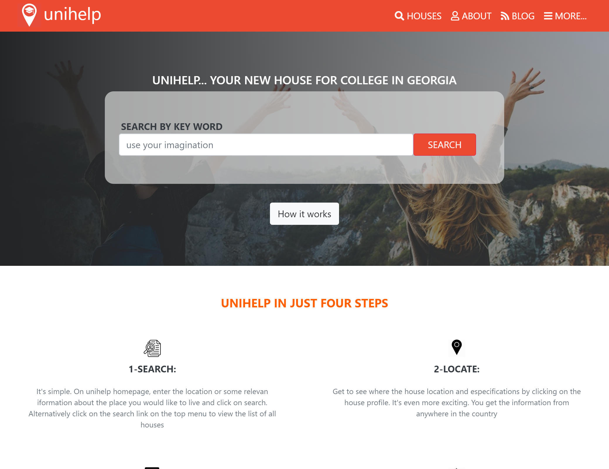
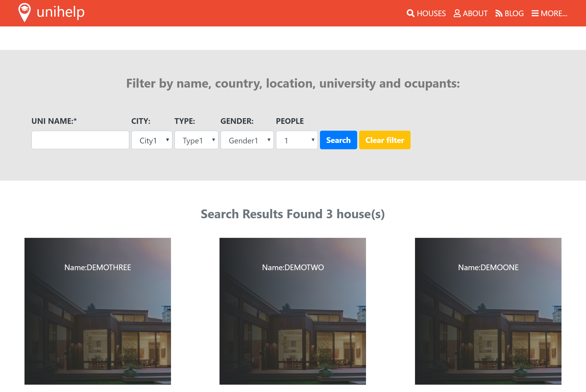
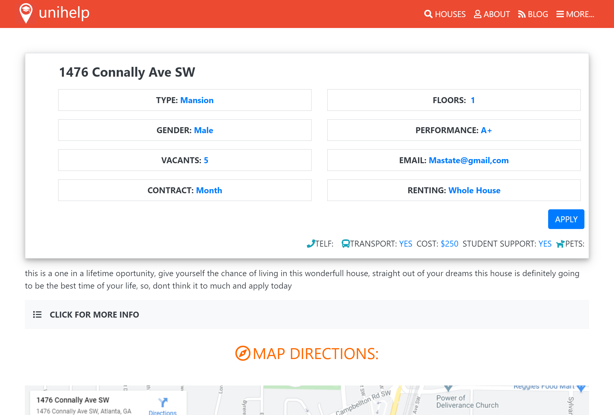

# Unihelp

in this series of pages, I try to replicate in my own version the concept of the pastashule page making use of bootstrap, and CSS as part of my capstone project in the microverse university

# Index

# Search

# Result

## Built With

- HTML, CSS. and bootstrap

## Authors

👤 Ricardo Vera
- Github: [@ricardo123321](https://github.com/ricardo123321)
- Twitter: [@ricardo615920830](https://twitter.com/ricardo615920830)
- Linkedin: [linkedin](https://www.linkedin.com/in/ricardo-vera-7381a81a2/)

## 🤝 Contributing

Contributions, issues, and feature requests are welcome!

Feel free to check the [issues page](issues/).

## Show your support

Give a ⭐️ if you like this project!

## Live Demo
[Live Demo Link](https://raw.githack.com/ricardo123321/Unihelp/features/index.html)

## Acknowledgments

- the code reviewer
- Mathew Njuguna
- Sam Achola
- Kevin Mutua
